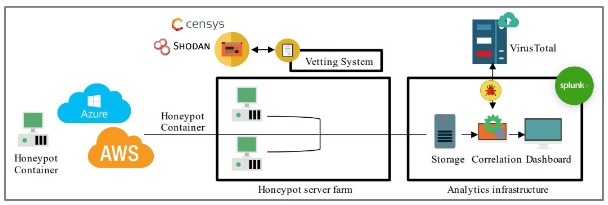
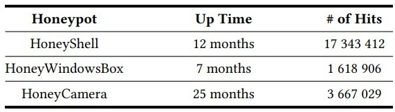

**Título do Artigo:** Honeypot experiment reveals what hackers want from IoT devices

**Link:**  [Honeypot Experiment Reveals What Hackers Want From IoT Devices.](https://cacm.acm.org/news/257716-honeypot-experiment-reveals-what-hackers-want-from-iot-devices/fulltext)

**Link (Versão Completa):** [What are Attackers after on IoT Devices?](https://arxiv.org/pdf/2112.10974.pdf)

Esta é uma resenha do artigo “What are Attackers after on IoT Devices?”, escrito por Tabari et al. O artigo mostra um experimento feito pela U.S. National Institute of Standards and Technology e University of Florida, e teve como objetivo estudar os ataques direcionados a dispositivos IoT (Internet of Things). Os dispositivos IoT são pequenos dispositivos conectados na internet, como câmeras, smart TVs, lâmpadas, sensores de movimento, speakers, entre outros. Essa análise foi realizada utilizando Honeypots. Os Honeypots são sistemas criados propositalmente com vulnerabilidades para atrair os atacantes. Com isso, além dos dados do ofensor, pode-se obter dados detalhados do que foi feito durante os ataques.

Em relação à infraestrutura criada para realizar o experimento, pode-se dividi-la em três partes principais: conjunto de servidores, sistema de verificação e ferramentas de coleta e análise de dados. Além disso, foram utilizados quatro honeypots: Cowrie, Dionaea, KFSensor e HoneyCamera. Para que essas instâncias fossem caracterizadas como reais, os pesquisadores as incluíram no Censys e Shodan, que são ferramentas de busca especializadas em encontrar serviços/dispositivos conectados na Internet.

Três honeypots para simular alguns serviços foram utilizados: 
 - HoneyShell para emular um Busybox
 - HoneyWindowsBox para emular dispositivos IoT rodando Windows
 - HoneyCamera para emular várias câmeras IP da Hikvision, D-Link, entre outras

Um ponto interessante na metodologia utilizada foi a atualização das configurações de segurança dos honeypots de acordo com os dados já obtidos. Isso possibilita a obtenção de dados mais diversificados e detalhados.

Os resultados do experimento mostraram um total de 22.6 milhões de ataques divididos da seguinte forma:

Os pesquisadores identificaram que vários ataques seguiam um padrão, o que pode significar que possuíam objetivos e métodos semelhantes. Alguns exemplos citados foram: a utilização de comandos como, “masscan” para escanear portas abertas, "/etc/init.d/iptables stop" para desabilitar firewalls e comandos para coletar características do hardware como, “free -m", "lspci grep VGA", e "cat /proc/cpuinfo".

Uma outra característica evidenciada pelo experimento foi a utilização de credenciais de acesso padrão para tentar invadir os sistemas. Mais de um milhão de ataques utilizaram as credenciais “admin / 1234”, por exemplo.

No que se refere aos objetivos dos atacantes, os que mais se destacaram foram a utilização dos recursos do sistema para minerar criptomoedas, realizar ataques DDoS (Distributed Denial of Service) e infectá-los com vírus.

Por fim, apenas 13% dos atacantes executaram comandos nos sistemas. Ou seja, 87% apenas tentaram encontrar a combinação correta do nome de usuário e senha e não prosseguiram para os próximos passos do ataque.
